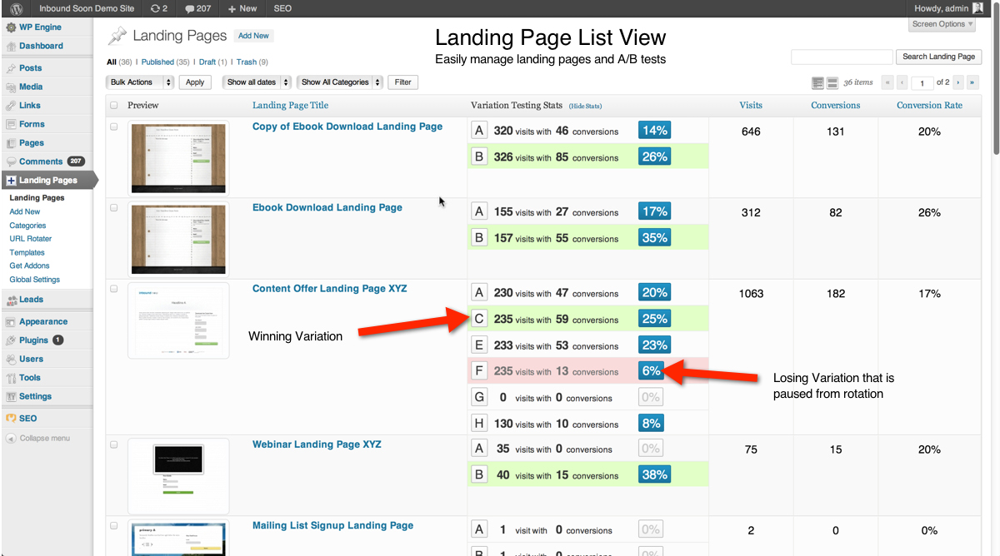
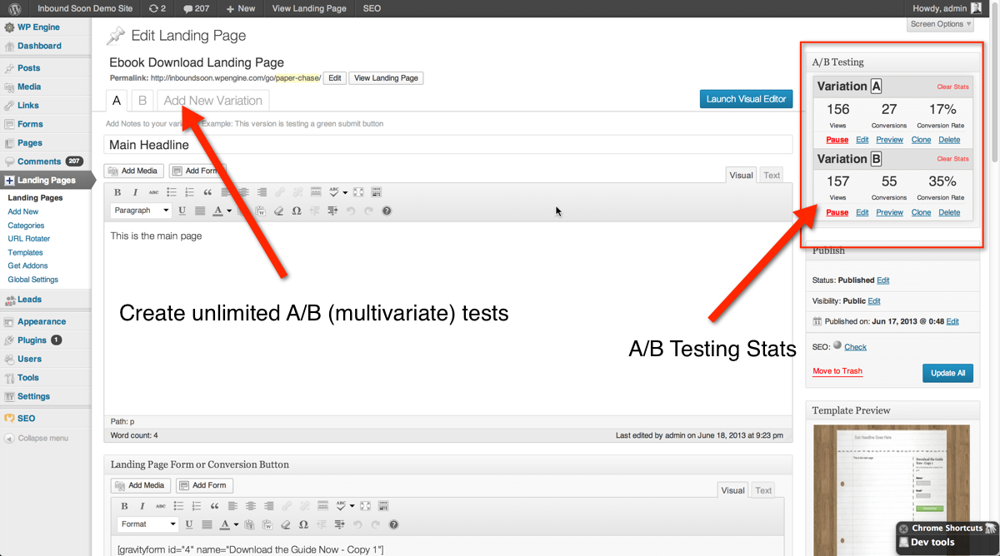
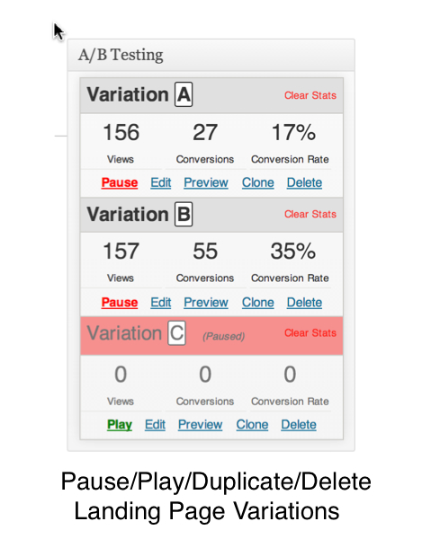
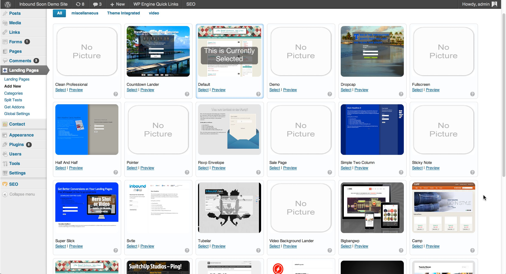

# WordPress Landing Pages #

**Contributors:** David Wells, Hudson Atwell  
**Donate link:** mailto:marketplace@inboundnow.com  
**License:** GPLv2 or later  
**License URI:** http://www.gnu.org/licenses/gpl-2.0.html  
**Tags:** landing pages, inbound marketing, conversion pages, split testing, a b test, a b testing, a/b test, a/b testing, coming soon page, email list, landing page, list building, maintenance page, squeeze page, inbound now, landing-pages, splash pages, cpa, click tracking, goal tracking, analytics, free landing page templates  
**Requires at least:** 3.8  
**Tested up to:** 4.1  
**Stable Tag:** 1.8.0  

Create landing pages for your WordPress site. Monitor and improve conversion rates, run A/B split tests, customize your own templates and more.

## Description ##

> WordPress Landing Pages works as a standalone plugin or hand in hand with [WordPress Calls to Action](http://wordpress.org/plugins/cta/ "Learn more about Calls to Action") & [WordPress Leads](http://wordpress.org/plugins/leads/ "Learn more about WordPress Leads") to create a powerful & free lead generation system for your business.

This plugin creates landing pages (a.k.a. conversion or splash pages) for your WordPress site. It gives site owners the ability to monitor and track conversion rates, run a/b or multivariate split tests on landing pages, and most importantly increase lead flow!

The landing page plugin was specifically designed with inbound marketing best practices in mind and will help you drive & convert more leads on your site.

Landing pages are an ideal way to convert more of your passive website visitors into active leads or email list subscribers.

### Highlights ###

* Create beautiful Landing Pages on your WordPress site.
* Visual Editor to view changes being made on the fly!
* Track conversion rates on your landing pages for continual optimization.
* Easily clone existing landing pages and run A/B Split tests on variations.
* Use your current WordPress theme or choose from our library of custom landing page designs.
* Pre-populate Forms with visitor information to increase conversion rates
* Gather lead intelligence and track lead activity with <a href="http://wordpress.org/plugins/leads/screenshots/">WordPress Leads</a>
* Extend functionality with our growing repository of <a href="http://www.inboundnow.com/market/category/landing-pages/extensions/">third party add ons</a>.
* Easily implement your own custom landing page design.

This plugin is form agnostic meaning it will work with any form system you use.

Recommended form plugins (Gravity forms, Ninja Forms or Contact form 7)

### About the Plugin ###

http://www.youtube.com/watch?v=flEd0sRTFUo

### Developers & Designers ###

We built the landing page plugin as a framework! Need A/B testing out of the box implemented for your existing designs? Use WordPress Landing Pages to quickly spin up new landing pages that have all the functionality your clients will need.

You can quickly take your existing designs and implement them using our <a href="http://docs.inboundnow.com/section/developer/">templating framework</a>.

The plugin is also fully extendable and has a number of actions, filters, and hooks available for use. If a hook doesn't exist, simply ask and we can implement custom changes.

[Follow Development on GitHub ](https://github.com/inboundnow/landing-pages "Follow & Contribute to core development on GitHub")
 |
[Follow Development on Twitter ](https://twitter.com/gitlandingpages "See our latest development commits on Twitter")

## Installation ##

1. Upload `landing-pages` folder to the `/wp-content/plugins/` directory
1. Activate the plugin through the 'Plugins' menu in WordPress

## Frequently Asked Questions ##
*Can I create my own landing page designs?,
*Yes! You can learn how to <a href="http://docs.inboundnow.com/guide/creating-landing-page-templates/">create your own landing page template here</a>.

## Screenshots ##

### 1. Landing Page Custom Post Type ###

### 2. Track conversion rates and continuously improve your landing pages ###

### 3. Manage Split Testing Page ###

### 4. Choose from a ton of pre-made templates, use your existing design, or design your own theme! ###

## Changelog ##
### 1.8.0 ###
* Fixing addon store

### 1.7.9 ###
* Even more security updates! Security for the win!

### 1.7.8 ###
* Security Patch

### 1.7.7 ###
* Fix double lead notification email

### 1.7.6 ###
* Fixed double email submission on contact form 7

### 1.7.5 ###
* Added form field exclusions to ignore sensitive data

### 1.7.3 ###
* See changelog here: https://github.com/inboundnow/landing-pages/issues?q=is%3Aissue+is%3Aclosed+label%3Av1.7.3

### 1.7.2 ###
* Improved form email typo detection
* Improved Template Styles
* Fixed content wysiwyg scroll freezing bug

### 1.7.1 ###
* removed iframe of inbound now addon store. For addons please visit: http://inboundnow.com/market

### 1.7.0 ###
* Removed anonymous PHP functions for PHP 5.2 support
* Updated template creation standards
* Converted varition modules to CLASS based system & documented
* Move /lang/ file outside of shared

### 1.6.2 ###
* Bug Fix: Fix with lead email notifications

### 1.5.9 ###
* Various bug fixes.
* Refactored main plugin file to class loader.
* Improved localization systems.

### 1.5.8 ###
* Bug Fix: Check all required fields

### 1.5.7 ###
* Improvement: All core template now use new consolidated settings system.
* Improvement: Leads Dashboard styling & stats
* Improvement: Screenshots on local installation replaced with template thumbnails.

### 1.5.6 ###
* Fix to insert marketing shortcode popup

### 1.5.5 ###
* Added events to lead tracking
* Bug Fix: Marketing Button
* Optimized CTA Tracking JS.
* Expanded impression/conversion analytics to all post types.

### 1.5.4 ###
* Impression tracking bug fix.
* Bringing Inbound Tracking to All Posts/Pages

### 1.5.3 ###
* Temporary fix for shortcodes disappearing from wordpress 3.8 to 3.9
* Performance improvements on analytics and lead tracking

### 1.5.1 ###
* Misc bug fixes

### 1.5.0 ###
* fixed field mapping bug
* Added better compability for js conflicts
* Prepping for marketing automation

### 1.4.9 ###
* Fixed and improved default landing page templates
* Updates to work with V2 of the CTA plugins
* Improved form compatibilty with contact form 7, gravity forms, and ninja forms
* Numerous bug files and code improvements

### 1.4.8 ###
* Added Google Analytics Custom Event Tracking for form submissions
* Added Ability: automatically sort leads into lists on form completions
* Added Ability: Send lead notification emails to multiple people. Use comma separated values
* Improved Social Media Buttons called with lp_social_media() function
* Fixed qTranslate plugin bug
* Fixed Genesis Title tag conflict
* Added improved asset loader
* Updated main docs.inboundnow.com site. Check it out!

### 1.4.7 ###
* GPL fix with js library

### 1.4.6 ###
* New Feature: Bulk Lead management with leads plugin wordpress.org/plugins/leads/
* Added tags to lead profiles for improved management/categorization
* Added new compatibility options to fix third party plugin conflicts!
* Added new debugging javascript debugging tools for users
* Fixed Email Sending Error on forms
* Improved support for master license keys

### 1.4.5 ###
* Added New HTML Lead Email Template with clickable links for faster lead management
* Added Button Shortcodes!
* Added HTML field option to form tool
* Added Divider Option to Form tool
* Added multi column support to icon list shortcode
* Added Font Awesome Icons option to Inbound Form Submit buttons
* Added Social Sharing Shortcode
* Bug fix - emails not sending after form conversion fixed

### 1.4.1 ###
* Bug fix - missing trackingObj

### 1.4.0 ###
* Added feature request form to all plugin admin pages. Submit your feature requests today! =)

### 1.3.9 ###
* Bug fixes for form creation issues
* Bug fixes for safari page tracking not firing
* Added quick menu to WP admin bar for quicker marketing!

### 1.3.8 ###
* Updated styles to 3.8 wordpress
* Streamlined form creation
* fixed rogue PHP errors

### 1.3.7 ###
* Added: Shortcode now automatically render in landing page option echos in templates
* Updated: Visual Editor tool
* Updated: Template selection interface
* Updated: Major updates to core templates, CSS tweaks and fixes
* Fixed: Shortcode insert into correct editor box
* Fixed: editor always on HTML view

### 1.3.6 ###

* Added: New Shortcodes! Fancy List and Column shortcodes
* Added: Added email confirmation support to Inbound Forms tool
* Added: Added New Welcome Page with Tutorial Video on Getting Started
* Added: New Debug Tab for faster support requests/debugging
* Fixed: CSS conflicts with button classes

###  1.3.1 ###

* Added: Added InboundNow form creation and management system (beta)
* Added: Support for InboundNow cross plugin extensions
* Added: 'Sticky Variations' to global settings.
* Added: Easier way for extension developers to license their extensions.
* Added: 'header' setting component to global settings.
* Fixed: Security issues
* Improvement: Improved data management for global settings, metaboxes, and extensions.

###  1.2.3 ###

* Fixed: Security issue with vulnerability to sql injection.

###  1.2.1 ###

* Fixed: Issues with shortcodes rendering in wp-admin for variations.

###  1.1.9 ###

* Fixed: Issues with navigation menu items breaking on landing pages with the default template selected.

###  1.1.8 ###

* Fixed: Issue with post_content not saving for variations.
* Added: [lp_conversion_area] Shortcode. It renders form conversion area anywhere on landing page
* Fixed: Restored the ability to delete custom templates from 'Templates' section.

###  1.1.7 ###

* Fixed: Issue with extension license keys not validating
* Fixed: Issue with shortcodes not firing on select core templates
* Improvement: Converted global settings data array to new easier to read format for development, added in legacy support.

###  1.1.0.1 ###

* Fixed: Variation saves for custom css and custom js.
* Fixed: jQuery error related to wysiwyg content formatting.

### 1.0.9.9 ###
* Improved extension metabox loading for quicker load times and optimized meta data storage.
* Phased out more 'old method' split testing components.
* Improved .htaccess parsing.
* Addressed issue with line breaks being removed from WYSIWYG editors.

### 1.0.9.4 ###
* Added in tours for the edit screen and the list of landing page screen for new users to learn how to use the tool quickly and easily
* Updated conversion tracking for wp-leads addon plugin
* Added in option for default templates to toggle on/off navigation

### 1.0.9.3 ###

* Removed old A/B split testing and the new system is fully in place!

### 1.0.9.0 ###

* Added in A/B stats to the main landing page list view

### 1.0.8.6 ###

* Release new and improved version of A/B testing!
* Ajax saving on landing page options for faster page edits
* Frontend Visual Editor to see what you are editing/changing
* Enabled frontend editor for use on normal pages and posts

### 1.0.8.5 ###

Providing better conversion and impression tracking for landing pages that are set as homepage.

### 1.0.8.4 ###

Fixing activation bug

### 1.0.8.1 ###

Fixing issue with jquery submission errors.

### 1.0.7.9 ###

Added capability to activate and update license keys for premium extensions. Added ability to define white listed HTML elements for Form Standardization process.

### 1.0.7.3 ###

Fixed issue with WP_List_table causing posts to to save or edit propperly Attempt 001

### 1.0.7.1 ###

Added cookie based auto-field population & lead data collection to core.

### 1.0.5.6 ###

Fixed issue with global setting's radio buttons not holding new set values.

### 1.0.5.3 ###

Solutions for custom post type wp rewrite issue on activation.

### 1.0.5.1 ###

Introducing version control system for extensions.

### 1.0.4.4 ###

Migrating store to new location.  Updating version control systems

### 1.0.4.2 ###

Added new defitions to form standardization parser. Limited .htaccess rewrites to plugin activation to try and mitigate .htaccess corruptions.

### 1.0.4.1 ###

Fixed issue with conversions not recording on some servers by forcing form submittal to wait until ajax has completely finnished loading before continuing to process form.

### 1.0.3.9 ###

Fixed issue with plugins and wp core refusing to update on some installations when landing page plugin is activated.

### 1.0.3.8 ###

Debugging cross browser impressions and conversion tracking. Implemented soltion for url-to-postid conversions that's compatible with the /slug/ removal extension for landing pages plugin.
Added email validation check to prevent false positives when form standardization is turned on.

### 1.0.3.7 ###

**Bug Fix:** 'Clear Stats' button.  

### 1.1 ###

Released
